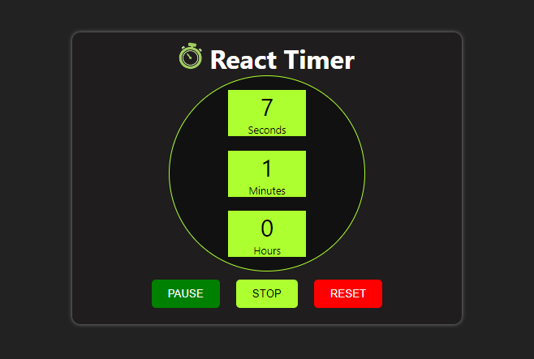
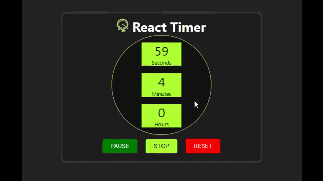

# React Timer App

This **React Timer** app is a light-scale React Stop Watch that allows you to keep track of the time elapsed. For instance, you can measure how long you've been working on your PC and even conveniently control breaks. The interface is beautifully designed with a few effects to make things interesting. 

## React Concepts Implemented
This is a lightweight React-based Timer. As a result it utilizes a few of React's API. However, it builds upon some of its popular concepts and ethics as listed below:

- **Components**: The entire app is built upon a single componet, the <code> Counter</code>. This handles the click events, UI rendering, among others.

- **State**: Here is another concept implemented here. Manipulating states with the <code>this.setState()</code> method and accessing the state with <code>this.state</code>. For instance, this allows the app to toggle Start/Pause button when clicked.

- **Props**: Props are useful means of sharing data with components in React, and so, this Stop Watch uses the <code>props</code> to determine the increment or steps of the timer. 

<pre>
<code>
    constructor(props){
        super(props)
    }
</code>
</pre>

- **Class**: Though functions can be used to create the component, I chose class. I find the ES6 class syntax to be friendly and cool to implement. So, there's was not thinking which one to use. This was direct:

<pre>
<code>
class Counter extends Component{
    //the rest happen
}
</code>
</pre>

- **Events**: Again  events handlers were implemented first by binding the events in the <code>constructor</code> and then on the individual buttons. E.g. <code>this.eventHandler = this.eventHandler.bind(this)</code>

- **Others**: In addition, the app equally demonstrates the use of conditional rendering, setting and destroying timers (e.g. <code>this.timer = setInterval((e)=>callback), 1000)</code> and <code>clearInterval(this.timer)</code>

## Key Features

With this React Timer, you have the privilege of doing the following:

- View seconds, minutes, and hours elapsed
- Control when to start the timer
- Pause/stop the timer whenever you want
- Start a new timer session with the **Reset** button

## Contributing
To contribute, clone the repo, make your preferred changes. Then make a pull request. Your updates will be review and merged if need be.

## License
This Timer uses the **MIT** license, meaning you're free to do whatever you to do with it. [View the license](./LICENSE)

